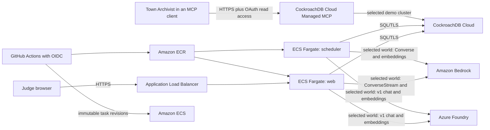

# Hollowmere Hackathon Technical Specification

- Status: Draft for guided-build approval
- Depends on: `docs/hackathon-prd.md`
- Target AWS region: `us-east-1`

## 1. Decisions

This specification fixes the following implementation choices:

1. Keep the existing Next.js web process and lease-guarded scheduler as separate
   containers.
2. Deploy both containers as Amazon ECS services on AWS Fargate.
3. Store immutable web and scheduler images in separate Amazon ECR repositories.
4. Use AWS CDK v2 with TypeScript for reproducible infrastructure.
5. Continue using GitHub Actions with OIDC for application delivery. Do not add
   CodePipeline or long-lived AWS access keys.
6. Use CockroachDB Cloud as the only transactional and vector datastore.
7. Keep Azure Foundry GPT-5.6 Terra as the only enabled public profile while the
   Bedrock support case is pending. `BEDROCK_ENABLED=true` later exposes Amazon
   Bedrock Claude Sonnet 5 without a code change. Use Bedrock on the canonical
   submitted path only after its live access gate passes.
8. Use CockroachDB Cloud Managed MCP as a read-only operator workflow called
   the Town Archivist. Do not embed Cloud MCP credentials in the public app.
9. Preserve Azure as the always-enabled profile. Exact Azure deployment and
   Bedrock inference-profile IDs remain server-owned configuration.
10. Use the current UI and engine. Add only the observability needed to prove a
    memory was written, recalled, and used.

## 2. System architecture



The public application does not call Managed MCP. MCP is the second qualifying
CockroachDB tool and provides an authenticated operator-agent investigation of
the same durable memory trail demonstrated in the product.

## 3. Repository changes

The build adds or changes these bounded areas:

| Path | Responsibility |
|---|---|
| `infra/aws/` | CDK app, registry stack, runtime stack, tests, and documented context. |
| `Dockerfile` | Add a migration target; retain explicit `web` and `scheduler` targets. |
| `.github/workflows/deploy-aws.yml` | Validate, build, push immutable images, deploy scheduler then web, and smoke-test. |
| `web/src/app/api/health/route.ts` | Process liveness endpoint for the ALB. |
| `web/src/app/api/ready/route.ts` | Deployment readiness endpoint with a bounded CockroachDB check. |
| `engine/inference/bedrock.ts` | Use Converse for text, keep InvokeModel for Titan embeddings, and use adaptive retries. |
| `engine/inference/profiles.ts` and `engine/inference/world.ts` | Validate and resolve the immutable provider profile selected for each private world. |
| `engine/social/retrieval.ts` and `engine/player/conversation.ts` | Record ANN, importance, recency, and pinned-anchor candidate provenance; persist recalled memory identifiers and paths in the structured turn outcome. |
| `engine/player/game-api.ts` and web contracts/UI | Expose a concise memory trace in the agent inspector. |
| `db/schema.sql` | Add stable read-only Archivist views if raw joins are too fragile for the MCP demo. |
| `scenario/instantiate.ts` and entry UI | Persist an allowlisted inference profile when a private world is created. |
| `db/runtime-role.sql` | Define the non-DDL runtime database identity. |
| `db/read-only-role.sql` | Describe the direct SQL reader accurately without claiming it authenticates Managed MCP. |
| `docs/town-archivist.md` | MCP setup, authorization boundary, prompt pack, and verification evidence. |
| `docs/aws-deployment.md` | Bootstrap, deploy, rollback, smoke, and teardown instructions. |
| `docs/plan.md` | Mark the original plan as historical and identify this package as the submission-build authority. |
| `README.md` | Present the verified AWS submission URL and architecture first while retaining Azure as a supported deployment. |
| `LICENSE` | Open-source license selected before Devpost submission. |

The existing uncommitted work in `engine/agents/dialogue.ts` is outside this
specification and must not be overwritten or staged incidentally.

## 4. AWS infrastructure

### 4.1 CDK application

Create an isolated TypeScript CDK project under `infra/aws` with its own
`package.json`, lockfile, strict `tsconfig.json`, `cdk.json`, `bin/`, and `lib/`.
The CDK CLI is an exact dev-dependency and is always invoked with `npx cdk`.

The application contains two stacks:

#### `HollowmereRegistryStack`

- ECR repository `hollowmere-web`.
- ECR repository `hollowmere-scheduler`.
- Immutable image tags.
- Scan on push enabled.
- Lifecycle policy retaining the most recent 20 commit images while protecting
  deployed tags from immediate cleanup.
- GitHub OIDC deploy role trusted only for
  `nnetraga97/hollowmere`, the `main` branch, and the `production` environment.

#### `HollowmereRuntimeStack`

- VPC spanning two availability zones.
- Internet-facing Application Load Balancer.
- ECS cluster with Container Insights.
- Fargate web service behind the ALB.
- Fargate scheduler service with no inbound listener.
- Separate task definitions, task roles, execution roles, and log groups.
- Secrets Manager references for runtime configuration.
- ACM certificate and HTTPS listener for the selected submission domain.
- HTTP-to-HTTPS redirect.
- CloudWatch alarms for unhealthy web targets, stopped ECS tasks, and repeated
  application failure events.
- CloudFormation termination protection for the runtime stack during judging.

The account/region must be bootstrapped once before the first CDK deployment.
Every infrastructure change follows `synth --strict`, `diff`, then `deploy`.

### 4.2 Network model

For the time-bounded hackathon deployment, Fargate tasks run in public subnets
with public IP assignment enabled but no public inbound rule. This avoids a NAT
gateway while still allowing outbound connections to CockroachDB Cloud and
Bedrock.

Security groups enforce:

- ALB: inbound TCP 443 from the internet and TCP 80 only for HTTPS redirect.
- Web task: inbound TCP 3000 only from the ALB security group.
- Scheduler task: no inbound rules.
- Task egress: HTTPS for AWS APIs and TCP 26257 for CockroachDB Cloud. DNS uses
  the VPC resolver.

This is a conscious cost/simplicity tradeoff. A later production hardening pass
may move tasks to private subnets with NAT or the complete set of required VPC
endpoints. That migration is not required for the submission.

### 4.3 TLS and public URL

The submitted URL must terminate TLS at the ALB using an ACM certificate. The
build stage therefore needs a domain name and a DNS validation path. Until that
value is supplied, infrastructure synthesis may use a required context value
but deployment cannot be declared complete.

`PUBLIC_ORIGIN` is set to the final HTTPS origin and all application redirects,
cookies, and same-origin checks are tested behind the ALB.

## 5. ECS services

All Fargate task definitions use `awsvpc`, Linux `X86_64`, platform version
`LATEST`, immutable commit image tags, and the `awslogs` driver in explicit
blocking mode.

### 5.1 Web service

| Setting | Initial value |
|---|---|
| Docker target | `web` |
| Container port | `3000` |
| Desired count | `1` |
| CPU | `512` units |
| Memory | `1024` MiB |
| Stop timeout | `60` seconds |
| Health grace period | `60` seconds |
| Rolling deployment | minimum healthy 100%, maximum 200% |
| Circuit breaker | enabled with rollback |
| ALB target type | `ip` |
| ALB health path | `/api/health` |
| Target deregistration delay | `30` seconds |

The service may scale to two tasks after one-task memory and latency measurements
are recorded. The database-backed signed-session model must remain correct with
multiple web tasks.

### 5.2 Scheduler service

| Setting | Initial value |
|---|---|
| Docker target | `scheduler` |
| Desired count | `1` |
| CPU | `1024` units |
| Memory | `2048` MiB |
| Stop timeout | `120` seconds |
| Rolling deployment | minimum healthy 0%, maximum 100% |
| Circuit breaker | enabled with rollback |

The scheduler is a singleton non-serving worker, so deployment may briefly stop
it rather than overlap old and new tasks. Lease guards and unique
`(world_id, tick)` commits remain defense in depth. The deployment verifier must
still check for `scheduler_process_ready`, task stability, and absence of
lease-loss or repeated transaction-failure logs.

### 5.3 Migration task

Add a non-service `migration` Docker target containing `db/`, `scripts/`, the
engine database dependencies, and the schema. It runs `npm run db:migrate`
without `--fresh` using a DDL-capable secret unavailable to web and scheduler
tasks.

Database migration remains a deliberate release step. Application deployment
does not silently run DDL on startup.

## 6. IAM and secrets

### 6.1 Execution roles

Each task execution role may:

- Pull only from its required ECR repository.
- Write only to its service log group.
- Read only the named Secrets Manager secrets injected into that task.
- Decrypt only the KMS key used for those secrets, if a customer-managed key is
  selected.

`ecr:GetAuthorizationToken` is the one registry-level action whose resource is
`*`; repository actions remain resource-scoped.

### 6.2 Application task roles

The web and scheduler task roles receive only:

- `bedrock:InvokeModel` for the configured reasoning inference profile and Titan
  embedding model.
- `bedrock:InvokeModelWithResponseStream` for the reasoning path used by web
  dialogue.
- The model resources reached by the configured cross-region inference profile,
  when AWS IAM requires those underlying model ARNs.

The roles do not receive `AmazonBedrockFullAccess`, ECR permissions, secret-read
permissions, or database administrative permissions. AWS SDK credentials come
from the ECS task role; no `AWS_ACCESS_KEY_ID` or secret key is injected.

### 6.3 GitHub deploy role

GitHub Actions authenticates using OIDC. Its deploy role may:

- Push commit-tagged images to the two ECR repositories.
- Describe ECS services and task definitions.
- Register new revisions for the two named task families.
- Update only the two Hollowmere ECS services.
- Pass only the exact Hollowmere execution and task roles.

It does not receive general administrator access. Infrastructure changes remain
a separate CDK workflow with an explicit diff and operator approval.

### 6.4 Secrets Manager

Store these runtime secrets:

- `DATABASE_URL` using a non-DDL Hollowmere runtime SQL identity.
- `DATABASE_CA_CERT_BASE64`.
- `SESSION_SECRET` with at least 32 random bytes.
- A separate `DATABASE_MIGRATOR_URL` used only by the one-off migration task.

Set `INFERENCE_MODE=world` explicitly in both AWS task definitions. Keep
`BEDROCK_ENABLED=false` until the support case and live preflight are complete;
changing it to `true` makes the Bedrock card and server route available. Store
the exact Azure Terra deployment, Bedrock Sonnet inference profile, embedding
model IDs, region, dimensions, log level, scenario version, and rate limits as
task-definition environment values. Provider credentials remain task-role or
secret-store inputs and never come from the browser. Rotating an injected secret
requires a new ECS deployment because task-launch secret injection does not hot
reload.

## 7. Bedrock integration

### 7.1 API boundary

- Text completion uses `ConverseCommand`.
- Interactive dialogue uses `ConverseStreamCommand`.
- Titan Text Embeddings V2 continues to use `InvokeModelCommand` because
  embeddings are provider-specific and not a Converse chat operation.
- Every reasoning request sets `maxTokens` explicitly from the bounded engine
  request.
- The SDK client uses adaptive retry mode with five total attempts.
- Connection and inactive-request timeouts remain bounded.

The reasoning model ID remains environment-configurable. The existing
cross-region Haiku profile is a candidate, not a claim of current availability.
Release verification discovers current foundation models and inference profiles
in the target account and confirms access before deployment.

### 7.2 Model authorization gate

`npm run check:bedrock` must succeed using the same configured region, reasoning
profile, embedding model, dimensions, and IAM permissions assigned to the ECS
task role. The existing script verifies Titan embedding invocation, exactly 1024
embedding dimensions, a bounded completion, and streaming in that configured
region.

Separate gates cover what the script does not currently test:

- H-102 discovers every destination region used by the chosen inference profile
  and verifies the task-role resources cover them.
- H-202 unit tests the classification of retryable and non-retryable errors.
- Deployment verification inspects `inference_client_created` and served-turn
  metadata to prove `mode=bedrock` and the expected model ID in ECS.

### 7.3 Failure behavior

- Provider calls remain outside CockroachDB retryable transactions.
- Failed conversation embeddings use the existing same-dimension deterministic
  fallback and record model provenance.
- A failed or malformed completion produces an inert, allowlisted fallback.
- Prompts and raw provider responses are not written to CloudWatch logs.
- Structured logs retain task, prompt version, model ID, token counts, latency,
  and rejection reason.

## 8. CockroachDB memory design

### 8.1 Transactional memory

CockroachDB remains authoritative for worlds, conversations, turns, memories,
beliefs, actions, cognition records, provenance edges, access history, scheduler
leases, budgets, and tick commits.

Every user and scheduler operation remains scoped by `world_id`. Browser APIs
recover world ownership from the signed session and never trust a browser-
provided world identifier.

### 8.2 Distributed vector indexing

The existing qualifying index remains:

```sql
CREATE VECTOR INDEX IF NOT EXISTS world_memories_embedding_idx
  ON world_memories (world_id, agent_id, embedding vector_cosine_ops);
```

The retrieval query must constrain both prefix columns to equality, bind the
query vector as a parameter, order with cosine distance `<=>`, and run after
statistics are refreshed. Release verification asserts the plan contains vector
search, the expected index name, and the expected prefix spans.

The hybrid candidate query must also retain every path by which a memory entered
the candidate set: `ann`, `importance`, and `recency`. The pinned conversation
anchor is labeled `pinned_anchor` when it is added outside hybrid recall. If a
memory matches multiple draws, its structured provenance retains every matching
label rather than choosing one. The canonical demo counts as vector proof only
when its demonstrated memory includes `ann`; a query-plan assertion by itself is
necessary but insufficient.

The build does not add a second vector database or Bedrock Knowledge Base.

### 8.3 Runtime database identity

Add a `hollowmere_runtime` SQL role that can execute the application's required
SELECT, INSERT, UPDATE, and DELETE statements but cannot create or drop databases,
schemas, tables, roles, or cluster settings. The DDL-capable migrator identity is
kept separate.

`hollowmere_reader` remains a direct SQL read identity for first-party read
models. It is not the authentication mechanism for CockroachDB Cloud Managed
MCP.

## 9. Town Archivist through Managed MCP

### 9.1 Connection

- Endpoint: `https://cockroachlabs.cloud/mcp`.
- Transport: HTTPS.
- Configuration names the dedicated Hollowmere demo cluster ID.
- Authentication: OAuth, because short-lived authorization is preferred over a
  long-lived service-account API key for the recorded operator workflow.
- Authorization: OAuth consent grants `mcp:read` only; write permission remains
  unchecked.
- Tokens and local MCP configuration are never committed.

The connection is created in the MCP-compatible client used in the demo. It is
not exposed to anonymous players and does not run inside the Fargate tasks.

### 9.2 Product workflow

The required Archivist prompt is:

> For world `<world_id>`, trace how the claim `<claim_key>` reached
> `<agent_key>`. Return the originating conversation turn, durable memory,
> retrieval/access event, later cognition or dialogue outcome, and simulation
> ticks. Use identifiers from the database and state when a link is inferred
> rather than directly recorded.

The result is acceptable only if it is grounded in selected-cluster data and
uses explicit `world_id` filtering. The video shows the same claim, agent, and
world visible in the public application.

If repeated raw joins are too error-prone, add narrowly named read-only views:

- `archivist_memory_sources` for memory-to-turn/event provenance.
- `archivist_memory_accesses` for retrieval history.
- `archivist_cognition` for recorded decisions and recalled memory IDs.

The views expose no secrets, session tokens, connection strings, or hidden
provider prompts.

### 9.3 Verification

- Refresh the official Managed MCP connection documentation before setup and
  confirm the consent screen still offers independent read and write choices.
- Connect to the selected cluster using OAuth with `mcp:read` only.
- Record the consent state and available tool list; write tools such as
  `create_database`, `create_table`, and `insert_rows` must be absent or blocked.
- Run the canonical Archivist prompt.
- Confirm every returned identifier exists and belongs to the demo world.
- Confirm the demo workflow never requests or enables write authorization.
- Capture the relevant CockroachDB audit evidence without exposing credentials.

## 10. Judge-facing memory trace

The current agent inspector already exposes recent dialogue, beliefs,
relationships, and current action. Extend it with one compact `Memory trace`
section rather than a new dashboard.

For the selected NPC, return at most five recent relevant memories with:

- Memory ID shortened for display but copyable in full.
- Formation tick and last-accessed tick.
- Kind and bounded content excerpt.
- Claim key, when present.
- Source kind and source turn/event identifier.
- Whether the memory was recalled by the demonstrated later turn or cognition
  record.
- All candidate paths that supplied it: ANN/vector, importance, recency, or
  pinned conversation anchor.

Persist the recalled memory IDs and candidate paths in the structured
conversation outcome so the UI and Archivist can prove which memories were
supplied to the later response and whether the qualifying vector draw actually
contributed. Do not expose embeddings or hidden engine truth in the public UI.

## 11. Canonical demo fixture

The first candidate flow uses `tobias_reeve` and the claim
`physician_was_paid`. The existing `engine/player/converse.test.ts` test is only
baseline evidence: it uses `createStubClient()` through the single-shot
`converse()` path and proves that telling Tobias the claim can make him hold it
and spread it over subsequent ticks. It does not prove the public multi-turn
conversation path, live Bedrock classification, or ANN candidate provenance.

The release fixture must prove the complete public path:

1. Start a world with the canonical seed.
2. Reach Tobias through the normal player movement path.
3. State the prepared claim in a normal conversation turn.
4. Show the immediate belief or rumor effect.
5. End the conversation, which writes the durable summary memory and source
   edge.
6. Refresh the browser and resume the same signed world.
7. Speak to Tobias again about the claim, causing retrieval of the prior memory.
8. Show the recalled memory ID and all candidate paths in the turn outcome and
   agent inspector; the paths must include ANN/vector.
9. Advance the world and show the downstream rumor, belief, dialogue, or action.
10. Run the Town Archivist prompt for the same world, agent, and claim.

Before recording, add an integration test for this exact flow using the same
multi-turn first-party APIs used by the web route. Then run the prepared flow on
at least three fresh deployed worlds with `INFERENCE_MODE=world` and
`BEDROCK_ENABLED=true`; all three runs must produce the intended claim binding,
durable memory, ANN provenance, later outcome, and visible consequence. If reliability fails, adjust the
prepared interaction or deterministic engine boundary and repeat the gate. If a
different agent/claim produces a clearer proof, update this section and the
video script together. The video never relies on an undocumented manually
edited database row.

## 12. Health and observability

### 12.1 Web endpoints

`GET /api/health`:

- No authentication.
- No database or provider call.
- Returns HTTP 200 with service name and commit identifier when the Next.js
  process is alive.
- Used by the ALB.

`GET /api/ready`:

- No secret values in its response.
- Executes a bounded `SELECT 1` against CockroachDB.
- Returns HTTP 200 only when the web process can reach the database.
- Used by deployment verification, not by the ALB target group.

### 12.2 Scheduler readiness

ECS verifies that the essential scheduler process remains running. Deployment
verification additionally checks:

- The service reaches its requested running count.
- A new task emits `scheduler_process_ready`.
- No repeated `lease_renewal_failed`, `lease_lost`,
  `database_transaction_retries_exhausted`, `unhandled_rejection`, or
  `uncaught_exception` event occurs during the verification window.

### 12.3 Logs and alarms

- Separate CloudWatch log groups for web and scheduler.
- Explicit blocking log-driver mode.
- Initial retention: 30 days.
- No prompts, conversation bodies, cookies, database URLs, or credentials.
- Alarms for zero running web tasks, zero running scheduler tasks, unhealthy ALB
  targets, and bursts of server or inference failures.

## 13. Deployment workflow

### 13.1 Initial bootstrap

1. Verify AWS CLI v2, Docker, Node.js 24, CDK, account identity, region, and
   Bedrock access.
2. Bootstrap the account/region with the CDK permissions boundary selected by
   the operator.
3. Run `cdk synth --strict` and `cdk diff`.
4. Deploy `HollowmereRegistryStack`.
5. Build and push `bootstrap` web and scheduler images.
6. Deploy `HollowmereRuntimeStack` referencing the bootstrap image tag.
7. Run the migration task with the migrator secret.
8. Seed or publish the immutable scenario.
9. Verify scheduler stability, web readiness, TLS, and the canonical path.

No destructive CDK, ECS, ECR, or database operation occurs without a separate
target review and explicit approval.

### 13.2 Continuous delivery

The AWS workflow runs only after application validation succeeds:

1. Authenticate to AWS through GitHub OIDC.
2. Log in to ECR.
3. Build `linux/amd64` web and scheduler images from their explicit targets.
4. Push both images with the Git commit SHA; never deploy `latest`.
5. Render and register the scheduler task-definition revision.
6. Update the scheduler service and wait for a stable, ready task.
7. Render and register the web task-definition revision.
8. Update the web service and wait for healthy ALB targets.
9. Call `/api/health`, `/api/ready`, and the public landing page.
10. Publish commit, task-definition revisions, image digests, and public URL in
    the GitHub Actions summary.

Application deploys are serialized. A failed deployment uses the ECS circuit
breaker and returns to the last stable task definition.

## 14. Release gates

The AWS submission path is complete only when all gates pass:

- `npm run check` on a fresh CockroachDB instance.
- CDK TypeScript checks, unit assertions, `synth --strict`, and a reviewed diff.
- Docker builds for `web`, `scheduler`, and `migration` on `linux/amd64`.
- Bedrock preflight under permissions equivalent to the ECS task role.
- ECS task definitions explicitly set `INFERENCE_MODE=world` and
  `BEDROCK_ENABLED=true`, and deployment logs plus served-turn metadata prove
  the expected Bedrock model handled the canonical requests.
- CockroachDB Cloud preflight and schema migration with TLS `verify-full`.
- Retrieval plan assertion proves the vector index is selected, and the
  canonical memory's candidate paths include ANN/vector.
- Runtime database role cannot execute DDL.
- Web and scheduler services reach stable running counts.
- Public HTTPS, liveness, readiness, session, conversation, and reconnect smoke
  tests pass.
- Canonical memory write, recall, and consequence integration test passes; the
  deployed Bedrock-backed path then succeeds on three fresh worlds.
- Managed MCP Archivist returns the same trace using OAuth `mcp:read`, with write
  permission ungranted and write tools absent or blocked.
- Repository contains license, setup instructions, architecture diagram, and
  accurate tool disclosures.

## 15. Explicitly deferred

- EKS or Kubernetes.
- Bedrock Agents, AgentCore, Knowledge Bases, or a second vector store.
- CodePipeline, CodeBuild, or CodeDeploy.
- Multi-region ECS deployment.
- Automatic schema migration during application startup.
- Public MCP access for players.
- ccloud CLI or Agent Skills as additional qualifying tools.
- Removal of the Azure deployment before AWS verification.

## 16. Build-stage inputs

The implementation can begin without these values, but deployment cannot finish
until they are supplied or discovered safely:

- AWS account ID and confirmed deployment region.
- AWS CLI credential profile or SSO session used for one-time CDK bootstrap.
- Submission domain and DNS ownership for ACM validation.
- CockroachDB Cloud demo cluster ID and runtime/migrator connection secrets.
- OAuth-capable MCP client used in the recorded Archivist workflow.
- Bedrock reasoning inference profile and embedding model confirmed available to
  the account.
- Final open-source license choice: MIT or Apache 2.0.
